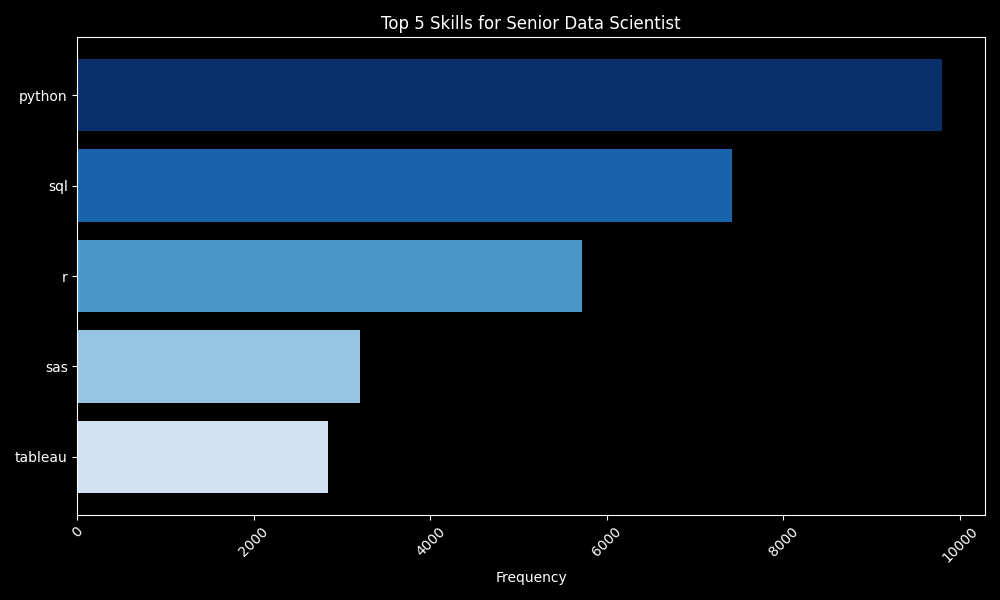

# Introduction

- This Project Explores the 2023 Market for Data-Related Jobs
- Investigating:
  - 💰 Top-Paying Jobs
  - 🔥 In-Demand Skills
  - 📈 Where High Demand meets High Salary in the World of Data

# The Tools I Used

- **SQL:** Running queries on the project database and revealing initial insights
- **Python:** Primarily used for data visualization here
  - **Libraries:** Pandas, Numpy, Matplotlib
- **PostgreSQL:** Database management system
- **Visual Studio Code:** My preferred IDE for project management and executing scripts in various programming languages
- **Git & GitHub:** Version control, project tracking, and sharing my scripts + analysis

### Initial SQL Queries - Questions to Answer:

1. What are the average salaries for the different data-related job roles?
2. Which job roles are the most in-demand?
3. What skills are most needed for the various job roles?
4. What are the most optimal skills to learn - based on demand and pay?

# Analysis

### 1. Average Salaries for the Different Data-Related Job Roles

SQL Query:

- Filter job postings by the year (2023) and the country that the job is located (U.S.)
- Group the data by job title and calculate average salary for each

```sql
-- Use Query #1 as a CTE
WITH postings AS (
    SELECT
        job_postings.job_id AS job_id,
        job_postings.job_title_short AS job_title,
        companies_dim.name AS company_name,
        job_postings.job_location AS job_location,
        job_postings.salary_year_avg AS avg_yearly_salary,
        job_postings.job_posted_date::DATE AS date_posted
    FROM
        job_postings
    JOIN companies_dim ON
        companies_dim.company_id = job_postings.company_id
    WHERE
        job_postings.job_country = 'United States' AND
        EXTRACT(YEAR FROM job_postings.job_posted_date) = 2023
    ORDER BY
        date_posted
)

-- Return the average salaries for each role from the CTE above
SELECT
    postings.job_title,
    ROUND(AVG(postings.avg_yearly_salary), 0) AS avg_yearly_salary
FROM
    postings
GROUP BY
    job_title
ORDER BY
    avg_yearly_salary DESC;
```

Here is a breakdown of the results:

- Specialized roles like **Senior Data Scientist** and **Machine Learning Engineer** offer the highest salaries
- The more entry level **Data Analyst** roles come with lower salaries in comparison
- Overall, expertise in data science and related fields correlate with higher compensation in the job market


_Bar graph visualizing the average salary for each job role, comparing each to the 2023 Median Salary for the U.S._

### 2. Market Demand by Job Title

SQL Query:

- Filter job postings by the year (2023) and the country that the job is located (U.S.)
- Group the data by job title and calculate the number of job postings for each

```sql
-- Use Query #1 as a CTE
WITH postings AS (
    SELECT
        job_postings.job_id AS job_id,
        job_postings.job_title_short AS job_title,
        companies_dim.name AS company_name,
        job_postings.job_location AS job_location,
        job_postings.salary_year_avg AS avg_yearly_salary,
        job_postings.job_posted_date::DATE AS date_posted
    FROM
        job_postings
    JOIN companies_dim ON
        companies_dim.company_id = job_postings.company_id
    WHERE
        job_postings.job_country = 'United States' AND
        EXTRACT(YEAR FROM job_postings.job_posted_date) = 2023
    ORDER BY
        date_posted
)

-- Return the demand for each job using the CTE above
SELECT
    job_title,
    COUNT(job_title) AS job_count
FROM
    postings
GROUP BY
    job_title
ORDER BY
    job_count DESC;
```

Here is a breakdown of the results:

- The tech/data field, in general, is a highly demanded career path
- **Data Analyst/Scientist** roles are needed the most, by far
- **Machine Learning/Cloud Engineering** is more of a niche market


_Bar graph visualizing the demand for each position, based on the number of 2023 job postings_

### 3. What Skills are Needed the Most for Each Position?

SQL Query:

- Filter job postings by the year (2023) and the country that the job is located (U.S.)
- Rank each skill according to its demand in each role
- Return the top 5 skills for each role based on the rankings

```sql
-- Use Query #1 as a CTE
WITH postings AS (
    SELECT
        job_postings.job_id AS job_id,
        job_postings.job_title_short AS job_title,
        companies_dim.name AS company_name,
        job_postings.job_location AS job_location,
        job_postings.salary_year_avg AS avg_yearly_salary,
        job_postings.job_posted_date::DATE AS date_posted
    FROM
        job_postings
    JOIN companies_dim ON
        companies_dim.company_id = job_postings.company_id
    WHERE
        job_postings.job_country = 'United States'
        AND EXTRACT(YEAR FROM job_postings.job_posted_date) = 2023
    ORDER BY
        date_posted
),
-- Rank each skill according to its demand in each role
ranked_skills AS (
    SELECT
        postings.job_title AS job_title,
        skills_dim.skills AS skills,
        COUNT(job_skills_dim.job_id) AS demand_count,
        ROW_NUMBER() OVER (PARTITION BY postings.job_title ORDER BY COUNT(job_skills_dim.job_id) DESC) AS skill_rank
    FROM
        postings
    JOIN job_skills_dim ON
        postings.job_id = job_skills_dim.job_id
    JOIN skills_dim ON
        job_skills_dim.skill_id = skills_dim.skill_id
    GROUP BY
        job_title,
        skills
)

-- Return the top 5 skills for each role based on the rankings
SELECT
    job_title,
    skills,
    demand_count
FROM
    ranked_skills
WHERE
    skill_rank <= 5;
```

Here is a breakdown of the results:

- **SQL:** Important for data-related roles
- **Python:** Valued across various positions
- **Excel:** Useful for business analysis
- **Tableau:** Key for data visualization
- **Cloud Skills (AWS, Azure):** Increasingly in demand for engineering roles
- **R and SAS:** Still relevant but less common
- **Machine Learning Frameworks:** Mentioned for Machine Learning Engineer roles, but less prevalent


_Bar graph visualizing the top 5 skills for Business Analyst roles, based on the frequency of mentions in job postings_


_Bar graph visualizing the top 5 skills for Cloud Engineer roles, based on the frequency of mentions in job postings_


_Bar graph visualizing the top 5 skills for Data Analyst roles, based on the frequency of mentions in job postings_


_Bar graph visualizing the top 5 skills for Data Engineer roles, based on the frequency of mentions in job postings_


_Bar graph visualizing the top 5 skills for Data Scientist roles, based on the frequency of mentions in job postings_


_Bar graph visualizing the top 5 skills for Machine Learning Engineer roles, based on the frequency of mentions in job postings_


_Bar graph visualizing the top 5 skills for Senior Data Analyst roles, based on the frequency of mentions in job postings_


_Bar graph visualizing the top 5 skills for Senior Data Engineer roles, based on the frequency of mentions in job postings_


_Bar graph visualizing the top 5 skills for Senior Data Scientist roles, based on the frequency of mentions in job postings_


_Bar graph visualizing the top 5 skills for Software Engineer roles, based on the frequency of mentions in job postings_
